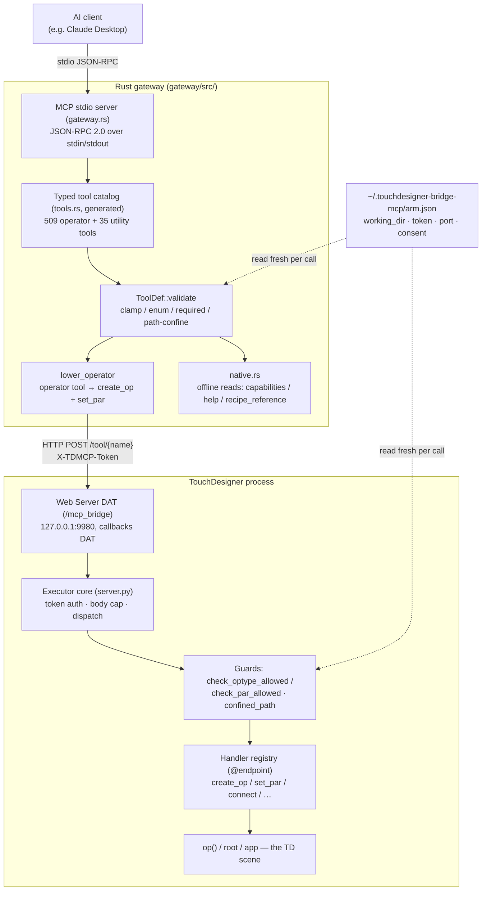

# アーキテクチャ — TouchDesigner Bridge MCP

TouchDesigner Bridge MCP は**2プロセス**構成のシステムです。型付きのMCPツールサーフェスをAIクライアントに提供するRust製**ゲートウェイ**と、稼働中のTouchDesignerセッション内にアームされる薄いPython製**エグゼキューター**からなります。ゲートウェイがTouchDesignerに直接触れることは決してありません。検証済みのリクエストをループバックHTTP経由でエグゼキューターに中継し、エグゼキューターがそれらをTouchDesignerのメインスレッド上でオペレーターグラフに適用します。

## 2プロセスの概要



## ゲートウェイ（`gateway/src/`、Rust）

ユーザーがTouchDesignerおよびAIクライアントと並べて実行する単一のバイナリです。これがクライアント側インストールのすべてであり、唯一のAIエントリポイントです。

- **`main.rs`** — ユーザーごとの設定を読み込み、ロギングをセットアップし（stderr + 作業ディレクトリ内の連番ログファイル。stdoutはMCPプロトコルストリーム専用に予約されています）、GUI（デフォルト）またはヘッドレスサーバー（`TDMCP_GW_HEADLESS`。Claude Desktop のような埋め込み起動によって設定される）のいずれかを起動します。serveパスは64 MBスタックのスレッド上で動作します。大きな型付きカタログの構築とシリアライズがWindowsの1 MBデフォルトをオーバーフローさせるためです。
- **`gateway.rs`** — MCP stdioサーバー（改行区切りのJSON-RPC 2.0）。`initialize` / `tools/list` / `tools/call` を処理し、すべての呼び出しを検証し、オペレーターツールをlowerし、`batch`メタツールを実行し、画像ツール向けにインラインPNGを埋め込み、呼び出しごとに監査イベントを発行します。これは入り口における唯一のセキュリティチョークポイントです。
- **`tools.rs`** — **生成された**型付きカタログ（約1.9 MB。決して手書き編集しません）。オペレーター型ごとに1つの`ToolDef`と、ユーティリティツール。ライブプローブされた`reference/catalog.json`から再生成されます。
- **`tool_schema.rs`** — `ToolDef::validate`（clamp / enum / 必須キー / 不明キー / パス制限）と`confine_path`（realpathによる制限）。
- **`executor.rs`** — TD内エグゼキューターへの型付きHTTPクライアント。接続/呼び出しごとに`arm.json`からポートとトークンを新鮮に解決します。
- **`config.rs`** — ユーザーごとの設定に加えて、`arm.json`のリゾルバー（`resolve_working_dir`、`resolve_executor_port`、`resolve_token`）と`reference_base()`。
- **`native.rs`** — 3つのゲートウェイネイティブツール（`td_capabilities`、`help`、`recipe_reference`）。プロセス内でオフラインに応答し、エグゼキューターへ転送されることは決してありません。
- **`gui.rs`** — TDテーマのGUI（作業ディレクトリのフィールド、ログトグル、ライブ監査ログ、およびランタイム由来のアームコマンド）。

ゲートウェイのどこにも、開発者マシンにハードコードされたものはありません。すべてのパス、ホスト、トークンは、ユーザーごとの設定、環境、または`arm.json`からランタイムに解決されます。作業ディレクトリのデフォルトはOS相対（ユーザーのDocuments配下のフォルダー）です。

## エグゼキューター（`td_executor/`、Python）

`arm.py`によってTouchDesignerの*内部*にアームされる、小さなデータ専用のハンドラーレジストリです。Python標準ライブラリとTouchDesigner自身の組み込み`td`モジュールのみを使用します — サードパーティパッケージのバンドルや再配布は一切ありません。

- **`server.py`** — エグゼキューターのコア：リクエストのディスパッチ、トークン認証、ループバック/クロスオリジンの拒否、データ専用のガード（`assert_no_rce_endpoints`、`check_optype_allowed`、`check_par_allowed`、`assert_writable`）、ファイルシステムの制限（`confined_path`、`working_dir`）、整合性検証（`verify_integrity`）、そして`dev_reload`。
- **`handlers/`** — 登録された動詞群。関心事ごとにグループ化されています：`control.py`（create_op、set_par、connect、delete_op、…）、`io.py`（save_top、write_csv、capture_ui、…）、`diagnostics.py`（scene_info、read_network、find_errors、inspect、top_info）、`reference.py`（operator_reference）、`scan.py`（import_scan / import_segmented_model）、`animation.py`、`glsl.py`、`expr.py`。各`@server.endpoint(...)`が`server._REGISTRY`に登録します。
- **`governor.py`** — アドバイザリな規模/テレメトリのガバナーに加えて、強制されるF-DOS-1の規模上限。
- **`glsl_validator.py` / `expr_validator.py`** — 2つのコードレーンのための、権威ある静的検証器（バリデーター）。

Web Server DATのコールバックはTouchDesignerの**メインスレッド**上で動作するため、ハンドラーは`op()` / `root`に直接触れます — メインスレッドへのマーシャリングポンプはありません。TDのグローバルは、薄いcallbacks DAT（`server.bind(op=…, root=…, app=…)`）によってリクエストごとにエグゼキューターへバインドされます。

## `lower_operator`エンジン — 単一のcreate+set_parチョークポイント

ゲートウェイは人間工学のために509個の異なる型付きオペレーターツールを公開しますが、それらは509個の別々のコードパスでは**ありません**。すべてのオペレーターツールは、同じ汎用エンジン（`gateway.rs`内の`lower_operator`）へと*lower*されます：

1. 予約された配置引数（`op_name`、`parent_path`、`pos_x`、`pos_y`）を取り出す。
2. エグゼキューターに対して`create_op {type, name?, parent?, x?, y?}`を呼び出し、結果から新しいノードの`path`を取得する。
3. 残りの検証済みパラメーターから`pars`マップを構築する — スカラーはそのまま通過し、ベクトルパラメーター（`Kind::NumVec`）は各コンポーネント名につき1エントリへと展開される。
4. `pars`が空でなければ、`set_par {op: path, pars}`を呼び出す。
5. `{path, created, applied?, …}`を返す。

したがって、型付きサーフェス全体が2つのエグゼキューター動詞 — `create_op`と`set_par` — に集約され、ひいては単一のパラメーターガード`check_par_allowed`を通過します。ユーティリティツール（`optype = None`）は、エグゼキューターへそのまま通過するか、または3つのネイティブツールについてはゲートウェイ内でオフラインに計算されます。`batch`は他のツールをオーケストレーションしますが、直接呼び出しにない機能を付与することはありません。ネストは構造的に拒否されます。

ビルド時のテスト（`operator_tools_carry_reserved_placement_args`）が、すべてのオペレーターツールが4つの予約された配置引数を持ち、すべてのユーティリティツールが持たないことを検証します。

## `arm.json` — 唯一の信頼源

`~/.touchdesigner-bridge-mcp/arm.json`は、両プロセスが合意する唯一のファイルです。アームがこれを書き込み、GUIの「Working dir」のApplyと同意トグルがこれを更新します。ゲートウェイとエグゼキューターの**両方**が、これを**呼び出しごとに新鮮に**読み取ります（ホットパスではmtimeキャッシュされます）：

```json
{
  "token": "<128-bit hex>",
  "port": 9980,
  "working_dir": "<confinement root>",
  "allow_expr": false,
  "allow_glsl": false,
  "allow_highres": false
}
```

- `working_dir`は*両方*のレイヤーの制限ルートです — エグゼキューターの`working_dir()`とゲートウェイの`resolve_working_dir()`が同じディレクトリを解決するため、GUIでの変更は再起動なし・再アームなしで有効になります。
- `token`と`port`により、再アームで新鮮なトークンをミントしたり、ポートを移動したりすることが、ゲートウェイの再起動なしに可能になります。
- `allow_expr` / `allow_glsl` / `allow_highres`は、人間がゲートする同意フラグです。素の再アームはこれらを保持します（レーンをサイレントにオン/オフに切り替えることは決してありません）。

## `reference_base`と作業ディレクトリの対比

2つのルートが意図的に分離されています：

- **制限作業ディレクトリ**（`arm.json`の`working_dir`） — ツールが読み書きしてよい場所。ユーザーが選択し、ソースツリーの外側に存在します。
- **リファレンスベース**（ゲートウェイでは`reference_base()`、エグゼキューターでは`_REPO_DIR`） — バンドルされた`reference/`データ（`catalog.json`、`recipes.json`、`help_map.json`、`descriptions.json`）のコード相対の場所。これはバイナリとともに出荷される*リソース*の場所であり、`TDMCP_REPO` / 実行中の実行ファイルの祖先から解決され、作業ディレクトリでは**ありません** — そのため、ユーザーが作業ディレクトリをどこに向けても、リファレンスの参照は同一に解決され、また、セキュリティ上重要なカタログが作業ディレクトリに制限されたファイル書き込みツールによって破壊されることは決してありません。

## レシピ / リファレンスのレイヤー

`reference/`配下のバンドルされたリファレンスデータが、3つの読み取り専用サーフェスを駆動します：

- **`operator_reference`**（エグゼキューター） — あるオペレーターの、正確な型付きパラメータースキーマ。
- **`help`**（ゲートウェイネイティブ） — あるオペレーターの事実（ファミリー、入力数、パラメーター名）に加えて、公式のDerivativeドキュメントへのディープリンク。Derivativeの散文はバンドルされていません。出荷されるオペレーターの説明はオリジナルです（`reference/descriptions_original.json`）。
- **`recipe_reference`**（ゲートウェイネイティブ） — 「ドライブレイヤー」：正規の、ツールにマップされたワークフローレシピ（`render`、`texture`、`projection-mapping`、`camera`、`output`、`choreography`、`show-control`といったドメインにまたがる66個のレシピ）。ファサードコンテンツを構築するための、規約と順序付けられたステップを運びます。`scripts/validate_recipes.py`によって検証されます。

## ロードモデル — 再起動が必要になるとき

2つのプロセスは、異なるリロードのライフサイクルを持ちます：

| 編集したもの… | 反映させるには… |
|-------------|----------------|
| `td_executor/**`のハンドラー（Python） | Textportで再アームする（または`dev_reload`を呼び出す） — ディスク上の編集をホットリロードし、古いバイトコードを一掃し、まず整合性を再検証します。**エグゼキューターを編集したら、`td_executor/INTEGRITY.json`を再生成してください**（`python scripts/gen_integrity_manifest.py`）。さもないと次のアーム/リロードがフェイルクローズします。 |
| `td_executor/server.py`そのもの | 完全な再アームを1回（`server`モジュールはホットリロードされません）。 |
| `gateway/src/*.rs`（生成された`tools.rs`を含む） | `gateway/`内で`cargo build --release`し、その後 Claude Desktop / MCPクライアントを再起動して新しいバイナリを再起動させます。 |
| `reference/*.json` | 次の呼び出しで新鮮に反映されます（ライブ読み取り）。リビルド不要、再アーム不要。 |
| 同意フラグ / 作業ディレクトリ | GUIのトグルを切り替えるか、作業ディレクトリをApplyする — `arm.json`に書き込まれ、次の呼び出しで新鮮に読み取られます。 |

ビルド/テスト/アームのループ全体については[CONTRIBUTING.md](CONTRIBUTING.md)を、これらの境界がどのように強制されるかについては[SECURITY.md](SECURITY.md)を参照してください。
