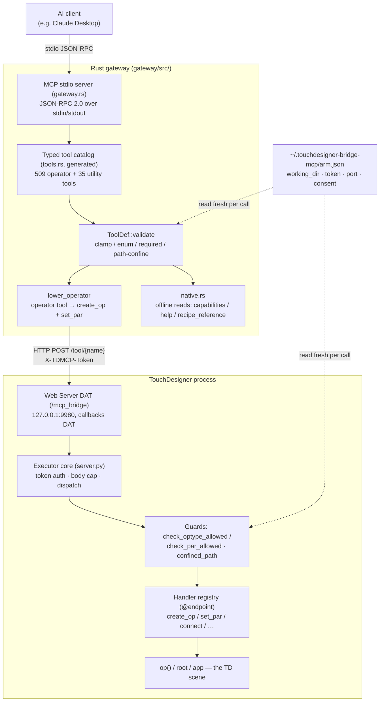

# Architecture — TouchDesigner Bridge MCP

TouchDesigner Bridge MCP is a **two-process** system: a Rust **gateway** that serves the
typed MCP tool surface to an AI client, and a thin Python **executor** armed inside a
running TouchDesigner session. The gateway never touches TouchDesigner directly; it relays
validated requests to the executor over loopback HTTP, and the executor applies them to the
operator graph on TouchDesigner's main thread.

## Two-process overview



## The gateway (`gateway/src/`, Rust)

The single binary a user runs alongside TouchDesigner and their AI client. It is the whole
client-side install and the sole AI entry point.

- **`main.rs`** — loads per-user config, sets up logging (stderr + a sequential log file in
  the working dir; stdout is reserved for the MCP protocol stream), and launches either the
  GUI (default) or a headless server (`TDMCP_GW_HEADLESS`, set by embedded launches like
  Claude Desktop). The serve path runs on a 64 MB-stack thread because building and
  serializing the large typed catalog overflows Windows' 1 MB default.
- **`gateway.rs`** — the MCP stdio server (newline-delimited JSON-RPC 2.0). Handles
  `initialize` / `tools/list` / `tools/call`, validates every call, lowers operator tools,
  runs the `batch` meta-tool, embeds inline PNGs for image tools, and emits an audit event
  per call. This is the single security choke point on the way in.
- **`tools.rs`** — the **generated** typed catalog (~1.9 MB; never hand-edited). One
  `ToolDef` per operator type plus the utility tools. Regenerated from the live-probed
  `reference/catalog.json`.
- **`tool_schema.rs`** — `ToolDef::validate` (clamp / enum / required-key / unknown-key /
  path-confine) and `confine_path` (realpath confinement).
- **`executor.rs`** — the typed HTTP client to the in-TD executor. Resolves port and token
  fresh from `arm.json` per connection/call.
- **`config.rs`** — per-user config plus the `arm.json` resolvers (`resolve_working_dir`,
  `resolve_executor_port`, `resolve_token`) and `reference_base()`.
- **`native.rs`** — the three gateway-native tools (`td_capabilities`, `help`,
  `recipe_reference`) answered offline in-process, never forwarded to the executor.
- **`gui.rs`** — the TD-themed GUI (working-dir field, log toggle, live audit log, and the
  runtime-derived arm command).

Nothing in the gateway is hardcoded to a developer machine. Every path, host, and token is
resolved at runtime from per-user config, environment, or `arm.json`. The working-dir
default is OS-relative (a folder under the user's Documents).

## The executor (`td_executor/`, Python)

A small, data-only handler registry armed *inside* TouchDesigner by `arm.py`. It uses only
the Python standard library and TouchDesigner's own built-in `td` module — no third-party
packages are bundled or redistributed.

- **`server.py`** — the executor core: request dispatch, token auth, loopback/cross-origin
  refusal, the data-only guards (`assert_no_rce_endpoints`, `check_optype_allowed`,
  `check_par_allowed`, `assert_writable`), filesystem confinement (`confined_path`,
  `working_dir`), integrity verification (`verify_integrity`), and `dev_reload`.
- **`handlers/`** — the registered verbs, grouped by concern: `control.py` (create_op,
  set_par, connect, delete_op, …), `io.py` (save_top, write_csv, capture_ui, …),
  `diagnostics.py` (scene_info, read_network, find_errors, inspect, top_info),
  `reference.py` (operator_reference), `scan.py` (import_scan / import_segmented_model),
  `animation.py`, `glsl.py`, and `expr.py`. Each `@server.endpoint(...)` registers into
  `server._REGISTRY`.
- **`governor.py`** — the advisory magnitude/telemetry governor plus the enforced F-DOS-1
  magnitude ceiling.
- **`glsl_validator.py` / `expr_validator.py`** — the authoritative static validators for
  the two code lanes.

The Web Server DAT callback runs on TouchDesigner's **main thread**, so handlers touch
`op()` / `root` directly — there is no main-thread marshalling pump. TD globals are bound
into the executor per request by the thin callbacks DAT (`server.bind(op=…, root=…, app=…)`).

## The `lower_operator` engine — one create+set_par choke point

The gateway exposes 509 distinct typed operator tools for ergonomics, but they are **not**
509 separate code paths. Every operator tool is *lowered* onto the same generic engine
(`lower_operator` in `gateway.rs`):

1. Pull the reserved placement args (`op_name`, `parent_path`, `pos_x`, `pos_y`).
2. Call `create_op {type, name?, parent?, x?, y?}` on the executor; take the new node's
   `path` from the result.
3. Build a `pars` map from the remaining validated params — scalars pass through; a vector
   param (`Kind::NumVec`) expands into one entry per component name.
4. If `pars` is non-empty, call `set_par {op: path, pars}`.
5. Return `{path, created, applied?, …}`.

So the entire typed surface funnels through two executor verbs — `create_op` and `set_par`
— and therefore through the single parameter guard `check_par_allowed`. Utility tools
(`optype = None`) either pass straight through to the executor or, for the three native
tools, are computed offline in the gateway. `batch` orchestrates other tools but grants no
capability a direct call lacks; nesting is structurally refused.

A build-time test (`operator_tools_carry_reserved_placement_args`) verifies that every
operator tool carries the four reserved placement args and every utility tool does not.

## `arm.json` — the single source of truth

`~/.touchdesigner-bridge-mcp/arm.json` is the one file both processes agree on. Arming
writes it; the GUI's "Working dir" Apply and the consent toggles update it; **both** the
gateway and the executor read it **fresh per call** (mtime-cached on the hot path):

```json
{
  "token": "<128-bit hex>",
  "port": 9980,
  "working_dir": "<confinement root>",
  "allow_expr": false,
  "allow_glsl": false,
  "allow_highres": false
}
```

- `working_dir` is the confinement root for *both* layers — the executor's `working_dir()`
  and the gateway's `resolve_working_dir()` resolve the same directory, so a GUI change
  takes effect with no restart and no re-arm.
- `token` and `port` let a re-arm mint a fresh token / move the port with no gateway
  restart.
- `allow_expr` / `allow_glsl` / `allow_highres` are the human-gated consent flags. A bare
  re-arm preserves them (never silently flips a lane on or off).

## `reference_base` vs the working directory

Two roots are kept deliberately separate:

- **The confinement working directory** (`arm.json` `working_dir`) — where tools may read
  and write. User-chosen; lives outside the source tree.
- **The reference base** (`reference_base()` in the gateway, `_REPO_DIR` in the executor) —
  the code-relative location of the bundled `reference/` data (`catalog.json`,
  `recipes.json`, `help_map.json`, `descriptions.json`). This is a *resource* location that
  ships with the binary, resolved from `TDMCP_REPO` / the running executable's ancestors,
  **not** the working dir — so reference lookups resolve identically no matter where the
  user points the working dir, and so the security-critical catalog can never be corrupted
  by a file-writing tool confined to the working dir.

## The recipe / reference layer

Bundled reference data under `reference/` drives three read-only surfaces:

- **`operator_reference`** (executor) — the exact typed parameter schema for one operator.
- **`help`** (gateway-native) — an operator's facts (family, input count, parameter names)
  plus a deep link to the official Derivative documentation. No Derivative prose is bundled;
  shipped operator descriptions are original (`reference/descriptions_original.json`).
- **`recipe_reference`** (gateway-native) — the "drive layer": canonical, tool-mapped
  workflow recipes (66 recipes across domains such as `render`, `texture`, `projection-mapping`,
  `camera`, `output`, `choreography`, `show-control`) that carry conventions and ordered
  steps for building façade content. Validated by `scripts/validate_recipes.py`.

## The load model — when a restart is needed

The two processes have different reload lifecycles:

| You edited… | To pick it up… |
|-------------|----------------|
| A `td_executor/**` handler (Python) | Re-arm in the Textport (or call `dev_reload`) — it hot-reloads on-disk edits, purging stale bytecode, and re-verifies integrity first. **After any executor edit, regenerate `td_executor/INTEGRITY.json`** (`python scripts/gen_integrity_manifest.py`) or the next arm/reload fails closed. |
| `td_executor/server.py` itself | One full re-arm (the `server` module is not hot-reloaded). |
| `gateway/src/*.rs` (incl. the generated `tools.rs`) | `cargo build --release` in `gateway/`, then restart the Claude Desktop / MCP client so it re-launches the new binary. |
| `reference/*.json` | Picked up fresh on the next call (read live); no rebuild, no re-arm. |
| A consent flag / working dir | Flip the GUI toggle or Apply the working dir — written to `arm.json`, read fresh on the next call. |

See [CONTRIBUTING.md](CONTRIBUTING.md) for the full build/test/arm loop and
[SECURITY.md](SECURITY.md) for how these boundaries are enforced.
